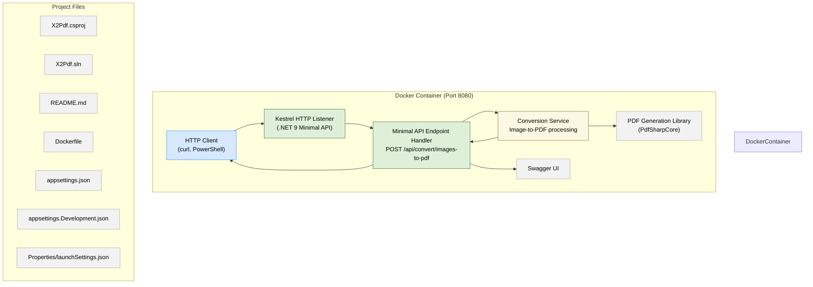

# X2Pdf - Conversor de Imagens para PDF

API simples para converter múltiplas imagens em um único arquivo PDF.



## Funcionalidades

- Converte imagens PNG, JPEG, GIF e BMP para PDF
- Aceita múltiplas imagens de uma vez
- Cada imagem vira uma página do PDF
- Interface Swagger para testes

## Como Usar

### Executar Localmente
```bash
dotnet restore
dotnet run
```

### Endpoint
```
POST /api/convert/images-to-pdf
```
### Executar usando a imagem Docker .tar (sem código-fonte)

[Baixe o arquivo x2pdf-latest.tar da release ou do repositório.](https://github.com/GabrielVesal/X2Pdf/releases/tag/v1.0.0)

Abra o terminal e navegue até a pasta onde o .tar está salvo (exemplo Windows):

```
cd C:\Users\gabriel\Downloads
```

Importe a imagem para o Docker local:

```
docker load -i x2pdf-latest.tar
```

Execute o container expondo a porta 8080:

```
docker run -p 8080:8080 x2pdf:latest
```

Acesse a interface Swagger no navegador:

```
http://localhost:8080/swagger/index.html
```

### Exemplo com PowerShell
```powershell
$images = @("imagem1.png", "imagem2.jpg")
$form = @{}
for ($i = 0; $i -lt $images.Length; $i++) {
    $form["files"] = Get-Item $images[$i]
}

$response = Invoke-RestMethod -Uri "https://localhost:8080/api/convert/images-to-pdf" -Method Post -Form $form
[System.IO.File]::WriteAllBytes("output.pdf", $response)
```

### Exemplo com cURL
```bash
curl -X POST "https://localhost:8080/api/convert/images-to-pdf" \
  -F "files=@imagem1.png" \
  -F "files=@imagem2.jpg" \
  --output output.pdf
```

## Swagger

Acesse [https://x2pdf-01vv.onrender.com/swagger](https://x2pdf-01vv.onrender.com/swagger) para testar a API.

## Tecnologias

- .NET 9
- Minimal APIs

## Docker

```bash
docker build -t x2pdf .
docker run -p 8080:8080 x2pdf
```
Após o container iniciar, acesse a interface Swagger da API no navegador:

http://localhost:8080/swagger
